# Anki Theme 
### Learning English grammar with Anki: 
Themes for Raymond Murphy’s system books and not only.
*(tested on macOs, AnkiMobile, Windows)*

#### Table of contents

<details>
 
<!-- toc -->

- [Some notes from official site.](#some-notes-from-official-site)
    * [<a href="https://apps.ankiweb.net/docs/manual.html#downloading-shared-decks" rel="nofollow">Self-made versus pre-made</a>](#self-made-versus-pre-made)
    * [Notes](#notes)
- [Card Types](#card-types)
    * [some necessary operations for this template:](#some-necessary-operations-for-this-template)
    * [Optional recommended](#optional-recommended)
- [Usage (keyboard interface control)](#usage-keyboard-interface-control)
- [Card Fields](#card-fields)
    * [✔ID:](#id)
    * [✔№ Unit:](#-unit)
    * [✔ Unit Name:](#-unit-name)
    * [✔♞Exercise:](#exercise)
    * [✔☛ Question:](#-question)
    * [★ Selectable choices (separate note type)](#-selectable-choices-separate-note-type)
    * [♫ Answer](#-answer)
    * [✎ Choices](#-choices)
    * [✎ Add Words 1 box and ✎ Add Words 2 box](#-add-words-1-box-and--add-words-2-box)
    * [♫ Question](#-question-1)
    * [♟ Example](#-example)
    * [»»♻«« Image for Question](#-image-for-question)
    * [♨ Hint Front](#-hint-front)
    * [♫ Hint Front](#-hint-front-1)
    * [♨ Hint Back](#-hint-back)
    * [♫ Hint Back](#-hint-back-1)
- [Technical note!](#technical-note)
- [By me a coffee](#by-me-a-coffee)

<!-- tocstop -->

</details>

---

This Anki theme will help make your English decks a little more effectively. [Janki method](https://apps.ankiweb.net/docs/manual.html#spaced-repetition), spaced repetition software is a helpful learning tool for English grammar from beginner to experienced.

The template is built in html, javascript and css. Include fields: audio, transcriptions.

#### Some notes from official site.
> ##### [Self-made versus pre-made](https://apps.ankiweb.net/docs/manual.html#downloading-shared-decks)
Creating your own deck is the most effective way to learn a complex subject. Subjects like languages and the sciences can’t be understood simply by memorizing facts — they require explanation and context to learn effectively. Furthermore, inputting the information yourself forces you to decide what the key points are, leading to a better understanding.

 > Do not learn if you do not understand.
—[SuperMemo](https://www.supermemo.com/en/articles/20rules)

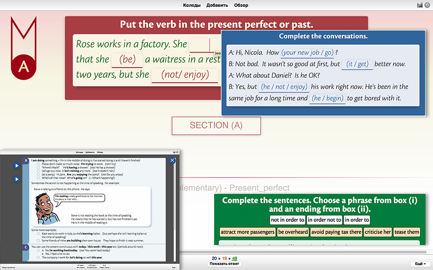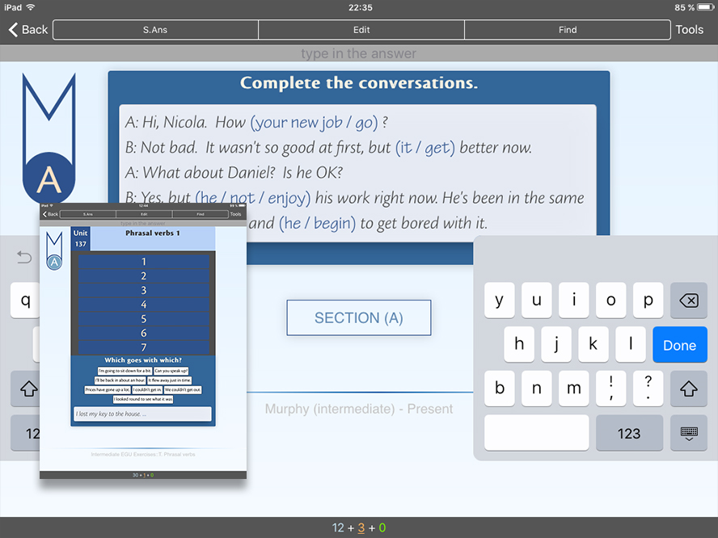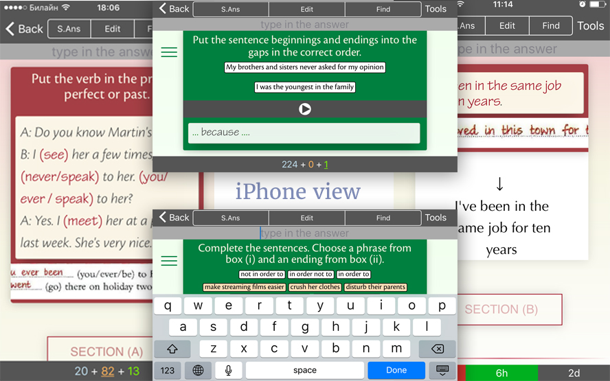

### Notes
>Each Anki client and each Anki version may implement card display differently, so you will need to test the behaviour across platforms. 
Currently was tested only Mac clients (desctop and iPad). But was made responsive layout for iPhones versions. 
Also was tested on the Windows 10 (desctop) last version Anki.

## Card Types
The type of card.<br>
 **[Cloze]**
  - Freeform show/hide, question/answer, audio/subtitles fields.<br><br>

#### some necessary operations for this template:
>- Anki doesn’t import fonts, so you need install these fonts **to your OS**:<br>
_CronosPro-Bold.ttf<br>
_CronosPro-Lt.ttf<br>
_CronosPro-LtIt.ttf<br>
_CronosPro-Regular.ttf<br>
_CronosPro-Semibold.ttf<br>
_TektonPro-Regular.ttf<br>
This fonts were taken from original source for best fitness. And some layouts were made for them. So it’s recommended.
For instaling in a folder `Reference files/fonts`
- On mobile version it is necessary switch off tap zones.
- Instal a plug-in: [Replay buttons on card](https://ankiweb.net/shared/info/498789867) for sound fields.

### Optional recommended
- For convenient filling of forms instal a plug-in: [Power Format Pack: Markdown, code blocks, lists, tables, syntax highlight & more](https://ankiweb.net/shared/info/162313389)
- [Additional Card Fields](https://ankiweb.net/shared/info/441235634) for distinction by color text of question:<br>
new card = blue<br>
studied card = maroon<br>
Repeated card = green<br>
`.q0 { color: blue; }`<br>
`.q1 { color: maroon; }`<br>
`.q2 { color: darkgreen; }`<br>

## Usage (keyboard interface control)
- <kbd>↑</kbd> - show modal window with theory
- <kbd>↓</kbd> - show Unit, name of the Unit
- <kbd>→</kbd> - show similar answer example
- <kbd>^</kbd> + <kbd>[1-7]</kbd> (numbers) - show corresponding to the number extra. window with gram. rules.
> pressing these keys again returns the previous
card display

## Card Fields
Fields marked **Optional** fields (♟ ♻ ✎ ♫ ♨) can be left blank and the template will ignore them. **Required** fields (✔) are required in order for a card to be generated.
### ✔ID: 
Required
> **example** - “3.4.9” = (3-unit); (4-exercise); (9-question).

### ✔№ Unit:
Required / optional (hiding field by button)

>**example** - “Unit 3”.

### ✔ Unit Name:
Required (hiding field by button)
>**example** - _“Present continuous and present simple 1
(I am doing and I do)”_.

### ✔♞Exercise:
Required
>**example** - “Complete the conversations.”.

### ✔☛ Question:
Required
>**example** -<br> 
“A: Hi, Nicola. How `{{c1::'s your new job going::(your new job / go)}}`? <br>
B: Not bad. It wasn't so good at first, but `{{c1::it's getting::(it / get)}}` better now. <br>
A: What about Daniel? Is he OK? <br>
B: Yes, but `{{c1::he isn't enjoying / he's not enjoying::(he / not / enjoy)}}` his work right now. He's been in the same job for a long time and `{{c1::he's beginning / he is beginning::(he / begin)}}` to get bored with it.”
> 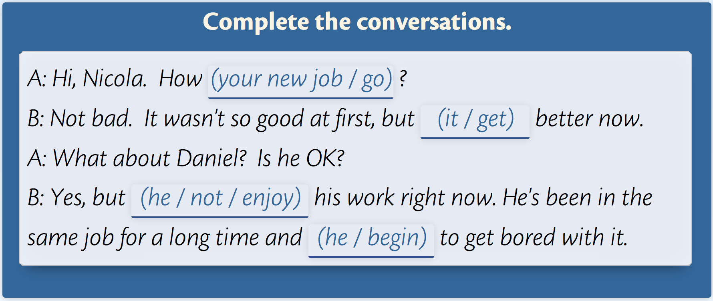<br>
To choose typing area press tab - once or twice.

>When you start typing in field the cursive example disappear. But it can be displayed by hover on the input field.

> 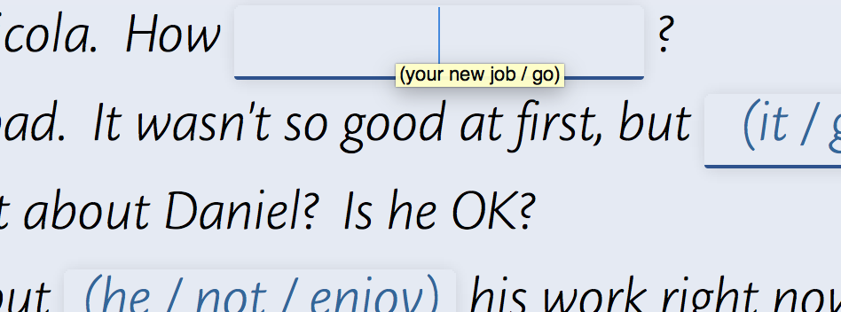
This field is button also. By the tap on this field `♟ Example` field opens

> 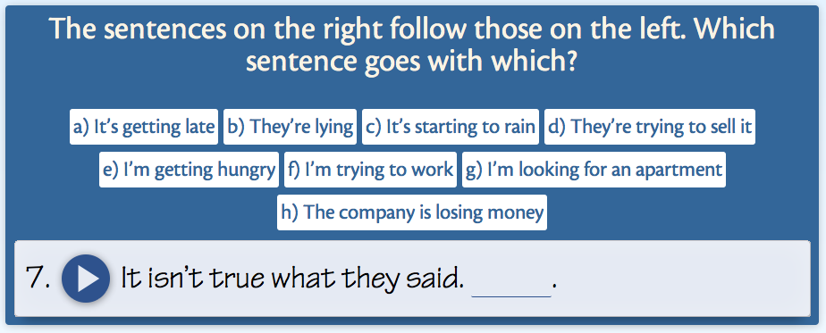
You can add sound into this field: `7. [sound:rec1491131723.mp3] It isn’t true what they said. {{c1::They’re lying / (b}}`.

###	★ Selectable choices (separate note type)
**(available only for [base] type of card)** | 
**(was not tested in AnkiDroid & Linux)**

Optional

- Choose from the suggested answers.
- The correct answer can be one or more.
- if the number of selected fields is more or less than the correct ones, any of the answers is not correct.
- filling this field must correspond to the following (divide the variants through this character "|"): 

`variant-1 | <i>variant-2</i> | variant-3`

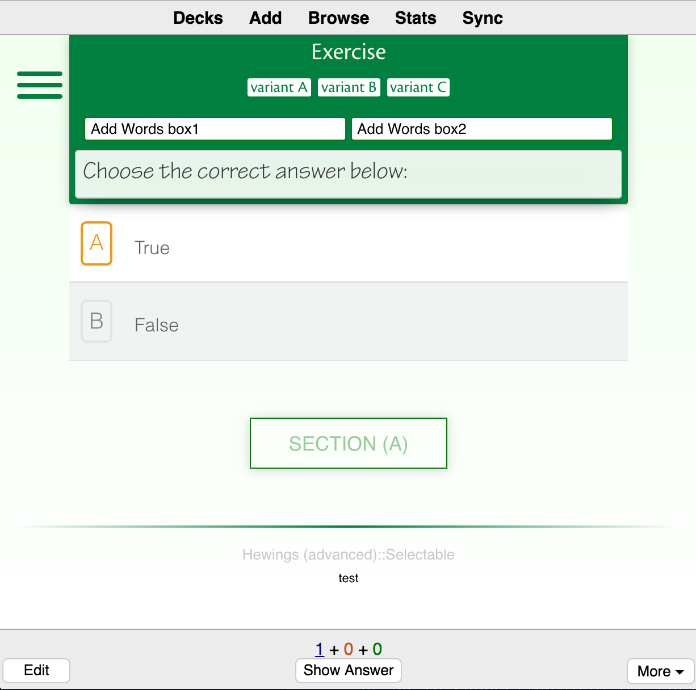

### ♫ Answer
Optional (on the back side of card)
>recommended use [AwesomeTTS text-to-speech add-on](https://ankiweb.net/shared/info/301952613) for this field.
> 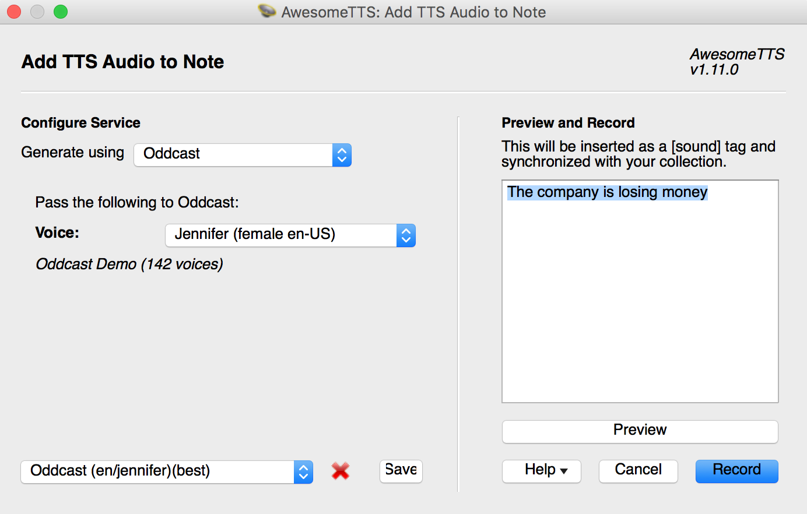<br>
> 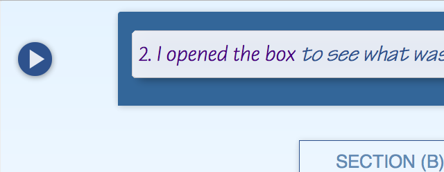
### ✎ Choices 
Optional
> **example 1** -<br>
“start; get;  increase;  change; rise”


> 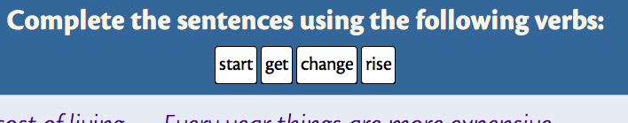<br>
use **“;”** for words split.


> **example 2** <br>
> “not in order to;in order not to;in order to | attract more passengers;be overheard;avoid paying tax there;criticise her;tease them”

> 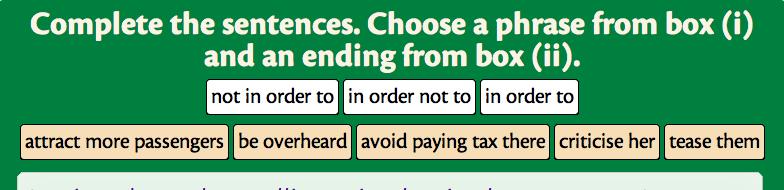<br>
and use **“|”** for differentiation of groups words.

### ✎ Add Words 1 box and ✎ Add Words 2 box
Optional
> **example** -<br>

> 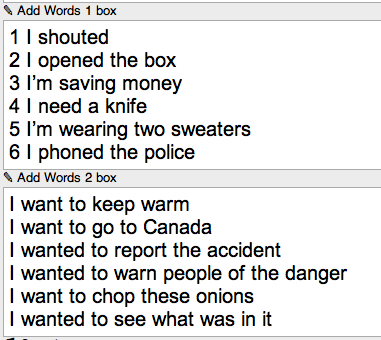<br>
edit

> 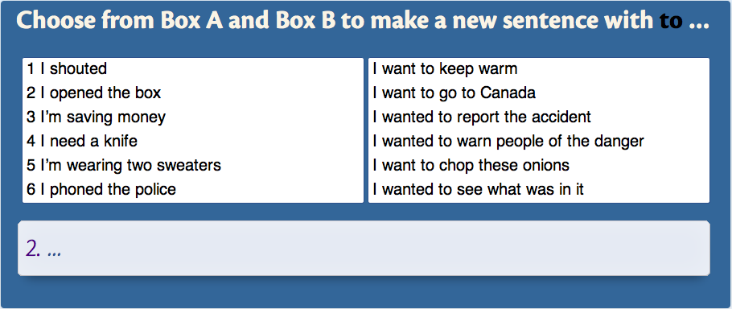<br>
_Or one box only_

> 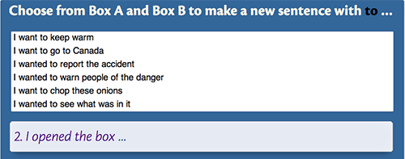<br>
_the second field is empty_

> And for anything but use sparingly, as it's always best to be succinct with Anki. Think of this as a 'reference' for future use:

> - Links to documentation
- Supplementary notes
- Anything that is universal between cards

### ♫ Question
Optional
> Sound for question if it necessary. In this case use `♟ Example` field for subtitles.

> 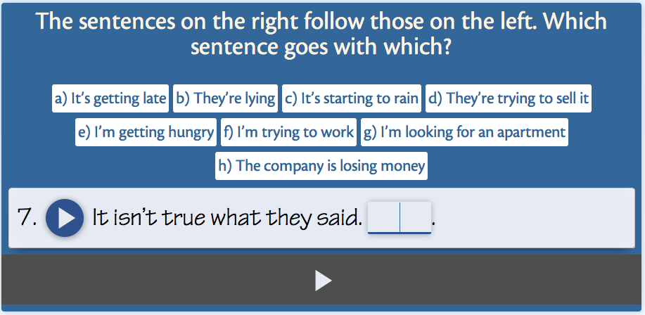
back side view

### ♟ Example
Optional (hiding field by button)
> image or text

> 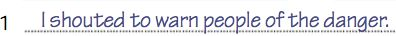<br>
example of screenshot

> 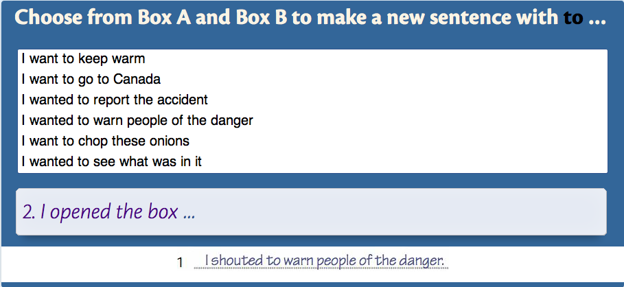<br>
on the card

### »»♻«« Image for Question
Optional
> Use it for image.

### ♨ Hint Front
Optional (hiding field by button)<br>
as idea this field for the theory
> If this field for image use - recommended width:  ~ 1000px;  
by example I paste “A”section’s screenshot from original book.

> 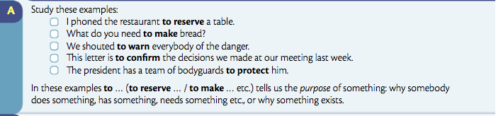<br>
example of screenshot

### ♫ Hint Front
Optional (hiding field by button)
>Sound for content of `♨ Hint Front` field.<br>
! If them several then - by a new row each sound.

! [](./readmeImg/example_sound_hint2.png)

### ♨ Hint Back
Optional <br>
(hiding field by button for back side card)<br>
as idea this field for the theory
> If this field for image use - recommended width:  ~ 1000px;  
by example I paste “B C D”sections’s screenshot from original book.

>  <br>
example of screenshot

### ♫ Hint Back
Optional <br>
(hiding field by button for back side of card)
> Sound for content of `♨ Hint Back` field.<br>
! If them several then - by a new row each sound.

> 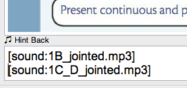

### Technical note!

There is a little, but noticeable difference in the display of the font (line-height) in comparison with Anki 2.0 and Anki 2.1. 

For 2.1 no changes require. For correct display of button in Anki 2.0 add the following code in the edit mode, in  "Styling" field to the end of this section.

For templates "Elementary" and "Intermediate":
```CSS 
.win #overlay_title #p_button,
.mac #overlay_title #p_button {
  line-height: 120%; 
}

.mac .overlay .p_app_button,
.win .overlay .p_app_button {
   line-height: 180%; 
}

.win .material-icons,
.mac .material-icons {
    line-height: 168%;
}
```
For template "Advanced":
```css
.win #overlay_title #p_button,
.mac #overlay_title #p_button {
  line-height: 120%; 
}

.mac .overlay .p_app_button,
.win .overlay .p_app_button {
   line-height: 180%; 
}

.win .material-icons,
.mac .material-icons {
    line-height: 168%;
}
.win .appendixes,
.mac .appendixes {
 margin-top: -340px;
}
```

### By me a coffee

<a href="https://www.buymeacoffee.com/cLMme6h" target="_blank"></a>

Created by [gh-md-toc](https://github.com/ekalinin/github-markdown-toc)
