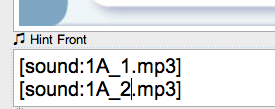

# Anki Theme 
## Изучайте Английскую грамматику с Anki: Шаблоны для книг по системе Murphy и не только.
- [Некоторые необходимые действия](#some-necessary-operations-for-this-template)
- [Опциональные рекомендации](#optional-recommended)
- [Поля карты](#card-fields)
- [Дополнительные примечания](#notes)

Эти шаблоны для Anki сделают ваши колоды по Англйской грамматике немного более эффективными. [Anki метод](https://apps.ankiweb.net/docs/manual.html#spaced-repetition), spaced repetition software is a helpful learning tool for English grammar from beginner to experienced.

Шаблон сделан на html, javascript and css. Включает поля: звука, транскрипции. На десктопной версии реализовано вписывание пропусков непосредственно в предложение. В iOs версиях множественные пропуски необходимо вписывать через запятую.

#### Некоторые записи с официального сайта.
> #####[Самостоятельно изготовленные колоды лучше полученных готовыми](http://finpapa.ucoz.ru/ankitest-manual.html#adding-material)
Создание ваших собственных колод карточек является наиболее эффективным путём для заучивания сложного предмета.
>>Для результативного освоения иностранных языков или точных наук недостаточно простого запоминания — требуется всему находить своё объяснение и свой контекст. Более того, самостоятельный ввод информации позволяет вам найти в ней ключевые моменты, ведущие к лучшему пониманию происходящего.

 > Do not learn if you do not understand.
—[SuperMemo](https://www.supermemo.com/en/articles/20rules)

 
В данном шаблоне максимально сохранен алгоритм осовения грамматики представленный в огригинале. Что заключается в следующем сценарии:

- Перед вами Упражнение и вопрос
- Если вы затрудняетесь ответить - нажатием на вопрос открывается пример аналогичного вопроса.
- Если необходима дополнительная информация вы отрывается секцию Appendix (7 шт)
- Если нужна дополнительная информаци вы открываете секцию теории “А”
Если ответ не верен или вы не понимаете почему он верен, на обратной стороне катрочки вы можете ознакомится с секциями теории “B, C, D e t.c” по аналогии с учебником где на левой стороне теория, а на правой стороне практика. 

Данный шаблон позволяет создавать вам собственные сценарии обучения. 

### Notes
> - Каждая версия программы Anki может реализовывать показ карточек различным образом (особенно на разных платформах), поэтому вы должны каждый раз тщательно тестировать поведение карточек в различной среде. Тем не менее. 
На данный момент было протестировано только для Mac clients (desctop and iPad). Но была сделана адаптивная верстка для iPhone версий. Так же протестировалось на Windows 10 (desctop) last version Anki.
- При определенной практике (используйте хот кеи (shift+command+C и shift+alt+command+C для скрытия слов), ставьте галку на полях “Помнить последние введенные данные”) заполнение карточек из одного юнита не занимает более 20 минут.
- Для тех кто знаком с версткой и методологией SMACSS - GitHub.

## Тип Карты
На данный момент представлен один тип карты 
 **[Cloze]**
  - Freeform show/hide, question/answer, audio/subtitles fields.  

####Некоторые необходимые действия для шаблона:
>- Анки не импортирует шрифты, так что небходимо установить шрифты вручную на вашу операционку: 
_CronosPro-Bold.ttf 
_CronosPro-Lt.ttf 
_CronosPro-LtIt.ttf 
_CronosPro-Regular.ttf 
_CronosPro-Semibold.ttf 
_TektonPro-Regular.ttf 
Эти шрифты были взяты из оригинальных источников издателей. И некоторая верстка была сделана под них. Так что это рекомендуется установить. 
Файлы для установки находятся в `Reference files/fonts`
- На мобильной версии необходимо отключить тап зоны.
- Установите плагин: [Replay buttons on card](https://ankiweb.net/shared/info/498789867) для звуковых вставок.

### Опциональные рекомендации
- Для удобства заполнения форм установите плагин: [Power Format Pack: Markdown, code blocks, lists, tables, syntax highlight & more](https://ankiweb.net/shared/info/162313389)
- [Additional Card Fields](https://ankiweb.net/shared/info/441235634) для разделение карточек по цвету текста вопроса: 
новая карта = blue 
на изучении = maroon 
повторяемая = green 
`.q0 { color: blue; }` 
`.q1 { color: maroon; }` 
`.q2 { color: darkgreen; }` 

## Card Fields
Поля помеченные **Optional** (♟ ♻ ✎ ♫ ♨) могут быть оставлены пустыми и шаблон проигнорирует их. **Required** поля (✔) необходимы для того, чтобы карта сгенерировалась.
### ✔ID: 
Required
> **example** - “3.4.9” = (3-unit); (4-exercise); (9-question).

### ✔№ Unit:
Required / optional (скрытое поле под кнопкой)

> **example** - “Unit 3”.

### ✔ Unit Name:
Required (скрытое поле под кнопкой)
>**example** - _“Present continuous and present simple 1
(I am doing and I do)”_.

### ✔♞Exercise:
Required
>**example** - “Complete the conversations.”.

### ✔☛ Question:
Required
> **example** -  
“A: Hi, Nicola. How `{{c1::'s your new job going::(your new job / go)}}`?  
B: Not bad. It wasn't so good at first, but `{{c1::it's getting::(it / get)}}` better now.  
A: What about Daniel? Is he OK?  
B: Yes, but `{{c1::he isn't enjoying / he's not enjoying::(he / not / enjoy)}}` his work right now. He's been in the same job for a long time and `{{c1::he's beginning / he is beginning::(he / begin)}}` to get bored with it.”

>  
Чтобы выбрать область ввода текста нажмите TAB - один или два раза.

> Когда вы начинаете печатать поле с курсивным примером исчезает. Но это может быть показано при нависании указателя мыши над полем.

>  
On the card

### ♫ Answer
Optional (для обратной стороны карточки)
>recommended use [AwesomeTTS text-to-speech add-on](https://ankiweb.net/shared/info/301952613) for this field.

> 
window of editing

> 
back side view

### ✎ Choices 
Optional
> **example 1** - 
“start; get;  increase;  change; rise”

>  
use **“;”** для разделения слов.

> **example 2**  
> “not in order to;in order not to;in order to | attract more passengers;be overheard;avoid paying tax there;criticise her;tease them”

>  
and use **“|”** для разделения группы слов.

### ✎ Add Words 1 box and ✎ Add Words 2 box
Optional
> **example** - 

>  
edit

>  
_Or one box only_

>  
_the second field is empty_

> И для чего угодно еще. Но используйте эти поля экономно, поскольку всегда лучше быть кратким в изучении по методу Anki. Думайте об этих полях как о ссылке для будущего использования:

> - Ссылки к документациям
- Дополнительные примечания
- Что-либо, что универсально между картами

### ♫ Question
Optional
>Звук для вопроса, если это необходимо. В этом случае используйте `♟ Example` поле для субтитров.

### ♟ Example
Optional (скрытое поле под кнопкой)
>image or text

>  
example of screenshot

>  
on the card

### »»♻«« Image for Question
Optional
>Use it for image.

### ♨ Hint Front
Optional (скрытое поле под кнопкой) 
> Если это поле используется для скриншота (изображения) - рекомендованная ширина скриншота:  ~ 1000px;  

>  
example of screenshot

### ♫ Hint Front
Optional (скрытое поле под кнопкой)
> Звук для теории `♨ Hint Front` field. 
! Если записей несколько - заполняйти каждую запись с новой строки.

### ♨ Hint Back
Optional  
(скрытое поле под кнопкой для оборотной стороны карты) 
> Если это поле используется для скриншота (изображения) - рекомендованная ширина:  ~ 1000px;  
by example I paste “B C D”sections’s screenshot from original book.

> 
example of screenshot

### ♫ Hint Back
Optional  
(скрытое поле под кнопкой для оборотной стороны карты)
> Звук для теории `♨ Hint Back` поле. 
! Если записей несколько - заполняйти каждую запись с новой строки.

> 

